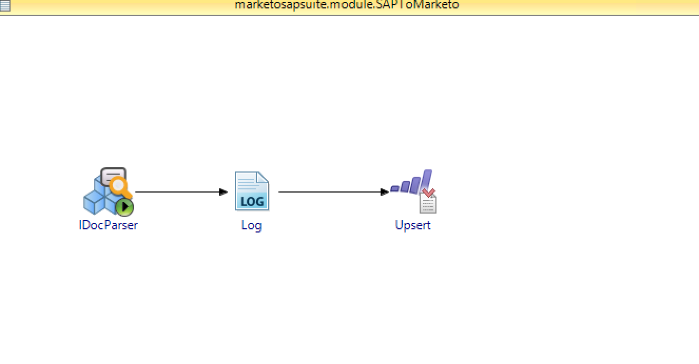
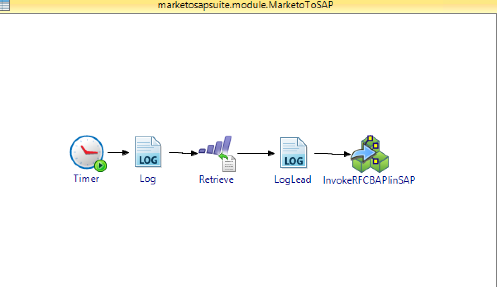

# TIBCO BusinessWorks Sample for SAP and Marketo
## Synopsis
The project consists of two BusinessWorks processes, to keep SAP and Marketo in sync. The project can be used as is, or as a quickstart to bootstrap the development of SAP to Marketo integration.

Note: Authentication values such as tokens and usernames/passwords are dummy values and will need to be updated for the sample to deploy properly.

## Process Diagram
### SAPToMarketo
This process listens for IDOC changes in SAP and creates a lead in marketo

### MarketoToSAP
This process fetches leads from Marketo and inserts it in SAP system

## Installation
Download or clone this repository onto your local machine and import the project (`SAPMarketoSuite`) into an existing TIBCO Business Studio workspace. Before running the application make sure to configure the `Module properties` listed below

### Marketo Module Properties
| Module Property       | Description                                 |
|:----------------------|:--------------------------------------------|
| /Marketo/EndpointUrl  | REST Endpoint url of Marketo instances      |
| /Marketo/IdentityUrl  | Indentity Endpoint url of Marketo instances |
| /Marketo/ClientId     | Client Id of Marketo instances              |
| /Marketo/ClientSecret | ClientSecret of Marketo instances           |
| /Marketo/LeadId       | Lead id to be inserted in SAP               |

### SAP Module Properties
| Module Property       | Description                                 |
|:----------------------|:--------------------------------------------|
| SAPAppServer          | IP Address of SAP server                    |
| SAPSystemNumber       | System  Number of SAP instance              |
| SAPClient             | Client Id of SAP instances                  |
| SAPUsername           | SAP Username                                |
| SAPPassword           | SAP Password                                |
| SAPSystemName         | SAP System Name                             |

## Question on this sample?
Feel free to open a Github issue or ask a question on the [TIBCO Community](https://community.tibco.com)

## Contributors
[Anshul Sharma]()

## License
See [LICENSE](./LICENSE) file
